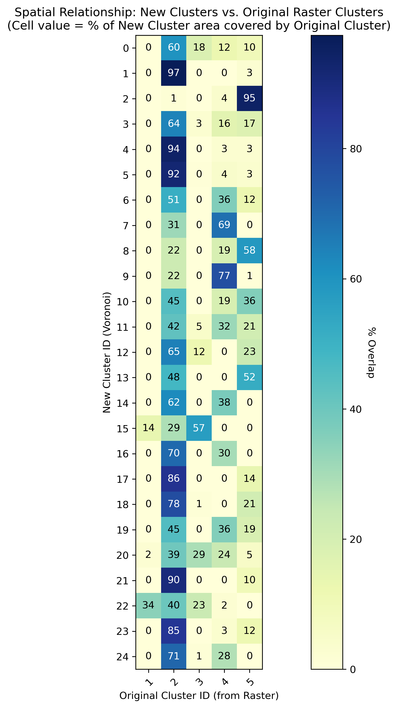

# Cluster Comparison Analysis

## Objective
Evaluate how the new Voronoi-based clusters (Task 5) relate to the original `clusters.tif` classification.

## Summary Statistics
- **Mean Purity Score:** 67.4%
- **Max Purity Score:** 97.4%
- **Min Purity Score:** 39.3%

## Interpretation
- **High Purity (>70%):** The new cluster closely matches one original cluster. These are likely stable regions where well distribution aligns with the raster logic.
- **Low Purity (<40%):** The new cluster spans multiple original clusters. This is expected since the new clusters are contiguous and based on well density, whereas the raster may have been fragmented.

## Overlap Matrix (Heatmap)

## Detailed Mapping
| New Cluster ID | Dominant Original Cluster | Purity (%) |
|----------------|---------------------------|------------|
| 0 | 2 | 59.9 |
| 1 | 2 | 97.4 |
| 2 | 5 | 94.5 |
| 3 | 2 | 64.1 |
| 4 | 2 | 94.1 |
| 5 | 2 | 92.0 |
| 6 | 2 | 51.3 |
| 7 | 4 | 68.8 |
| 8 | 5 | 58.4 |
| 9 | 4 | 77.1 |
| 10 | 2 | 44.9 |
| 11 | 2 | 42.3 |
| 12 | 2 | 64.8 |
| 13 | 5 | 52.0 |
| 14 | 2 | 62.2 |
| 15 | 3 | 57.0 |
| 16 | 2 | 70.3 |
| 17 | 2 | 85.9 |
| 18 | 2 | 78.0 |
| 19 | 2 | 45.1 |
| 20 | 2 | 39.3 |
| 21 | 2 | 89.8 |
| 22 | 2 | 40.1 |
| 23 | 2 | 84.8 |
| 24 | 2 | 70.8 |
