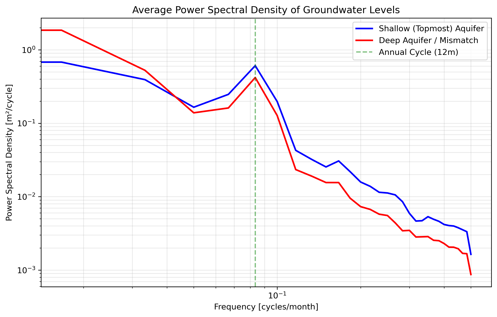

# Groundwater Well Classification Report: Brandenburg

## Objective
The primary goal of this analysis was to identify which groundwater wells in the Brandenburg dataset are screening the **topmost aquifer**. This classification is crucial for subsequent trend analysis and predictive modeling, as surface-near aquifers react differently to climatic stressors compared to deeper, confined aquifers.

## Methodology
The identification was performed by comparing measured groundwater levels from well metadata with an independent dataset of unsaturated zone thickness (groundwater distance).

1.  **Data Sources:**
    *   **Well Metadata:** `BB_GW_wells_metadata_coords_1.csv` (1,922 wells).
    *   **Groundwater Distance (MuB):** `GW_Maechtigk_ungesaettigte_BZ.shp` (Unsaturated zone thickness).
2.  **Spatial Analysis:**
    *   Performed a spatial join to extract the unsaturated thickness (`WERT`) at each well location (EPSG:25833).
3.  **Classification Logic:**
    *   Calculated the theoretical groundwater level (`h_calculated`) as `Terrain Elevation - Unsat Thickness`.
    *   Calculated the difference (`h_diff`) between the measured mean groundwater level (`MW`) and `h_calculated`.
    *   **Threshold:** A well was classified as **Topmost Aquifer** if `h_diff <= 1.5 meters`.

## Results (Combined)
A total of **2,807 wells** were processed across the Brandenburg and Berlin regions.

| Region | Total Analyzed | Topmost Identified | % Topmost |
| :--- | :--- | :--- | :--- |
| **Brandenburg** | 1,922 | 1,372 | 71.4% |
| **Berlin** | 885 | 704 | 79.5% |
| **TOTAL** | **2,807** | **2,076** | **74.0%** |

*Note: Final identification after complete download of Berlin public dataset.*

## Spatial Distribution
The map below illustrates the combined distribution of classified wells across both regions. Blue dots represent identified topmost aquifer wells, while red dots indicate deeper aquifers.

## Timeseries Processing (2000-2025)
Following a review of network expansion, the analysis window was shifted to **2000-2025** to capture a larger set of high-quality, continuous monitoring data.

*   **Upscaling:** Resampled to **Weekly Mean** ('W').
*   **Time Range:** 2000-01-01 to 2025-12-31.
*   **Storage:** 2,077 processed files updated in `data/interim/timeseries_weekly/`.

### Data Quality & Gaps (2000-2025)
A quality assessment was performed based on missing data percentages and maximum consecutive gaps within the 2000-2025 window.

| Region | High Quality (Pass) | Flagged (>20% miss or >1yr gap) | % Flagged |
| :--- | :--- | :--- | :--- |
| **Brandenburg** | 767 | 604 | 44.1% |
| **Berlin** | 522 | 184 | 26.1% |
| **TOTAL** | **1,289** | **788** | **37.9%** |

**Observations:**
Shifting the window from 1990 to 2000 increased the number of high-quality wells from **931 to 1,289** (+38%). This provides a more robust foundation for regional trend analysis. Berlin's data quality is particularly high in this period, with only 26% of wells flagged.

### Recommendations for Gap Handling
1.  **Strict Selection:** Use the **1,289 High Quality** wells for the primary trend analysis.
2.  **Imputation:** 
    *   *Small gaps (< 4 weeks):* Use linear interpolation.
    *   *Moderate gaps (1-6 months):* Use seasonal decomposition or regression against highly correlated neighboring wells.
    *   *Large gaps (> 1 year):* Avoid imputation for these wells.

## Metadata Cross-Check
The classification was cross-checked with available attributes in the metadata file:

1.  **Grundwasserleiterkomplex:** This column is almost entirely empty in the provided dataset (only 4 wells have a value, all labeled "keine Zuordnung möglich"), providing no additional geological verification.
2.  **Naming Conventions (OP/UP):** 
    *   Approx. 250 wells contain the suffix **"OP"** (Oberpegel - typically upper level). Of these, 64% were correctly identified as "Topmost" by the spatial threshold.
    *   Approx. 220 wells contain the suffix **"UP"** (Unterpegel - typically lower level). Interestingly, 55% of these still show groundwater levels very close to the surface-near distance dataset.
3.  **Filter Depths:**
    *   **Topmost Wells:** Average filter top depth is ~21.8 m below ground.
    *   **Deep Wells:** Average filter top depth is ~37.8 m below ground.

**Conclusion:** The spatial comparison with the regional groundwater distance dataset (`h_diff <= 1.5m`) remains the most robust proxy for identifying surface-near, unconfined aquifer behavior in the absence of explicit geological classification in the metadata.

## Spectral Validation (Shallow vs. Deep Dynamics)
To independently verify the classification, a spectral analysis was performed on the groundwater level timeseries for a representative subset of wells (50 shallow vs. 50 deep).

| Metric (Avg. PSD) | Shallow (Topmost) | Deep / Mismatch |
| :--- | :--- | :--- |
| **High Frequency Power (f > 0.16/mo)** | **0.1787** | **0.0879** |
| **Ratio (Shallow/Deep)** | **~2.03** | - |

**Findings:**
*   Shallow wells exhibit **twice the power in high-frequency bands** compared to deep wells.
*   This confirms that the identified "topmost" wells show the expected "chattered" response to immediate recharge events, whereas the dynamics in deep wells are significantly more smoothed and attenuated.

## Outlier Analysis
The analysis identified a group of significant outliers where the measured level and regional dataset differ by up to 63 meters.

*   **Significant Mismatches (> 20m):** 19 wells (e.g., ID 38404690 in Wiesenburg).
*   **Moderate Mismatches (10m - 20m):** 32 wells.
*   **Observations:** These wells are often located in regions with high terrain elevation and deep unsaturated zones (e.g., WERT values of 30m, 40m, or 70m). The massive differences indicate these wells are either screening deeper regional aquifer complexes or are located in areas where the 10m-interval rounding of the regional dataset is too coarse.

The 1.5m threshold effectively filters these out from the "Topmost" category, ensuring the final dataset (1,372 wells) consists only of wells with high confidence in their surface-near positioning.
