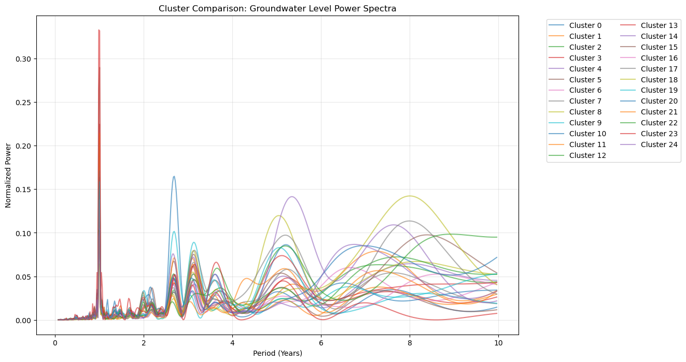

# Cluster-Scale Spectral Analysis Report

## Objective
Identify dominant groundwater level periodicities (e.g., annual, multi-annual) within each spatial cluster using the Lomb-Scargle periodogram on high-quality timeseries (2000-2025).

## Methodology
1. **Data Selection:** Only 'High Quality' wells (max gaps < 8 weeks) were included.
2. **Normalization:** Individual timeseries were detrended (mean removed) and variance-normalized before analysis.
3. **Spectrum:** Calculated Lomb-Scargle Power Spectral Density (PSD) for periods between 0.1 and 10 years.
4. **Aggregation:** Averaged normalized PSDs across all wells in a cluster to extract the regional signal.

## Key Findings
| Cluster ID | Dominant Period (Years) | Max Power | Interpretation |
|------------|-------------------------|-----------|----------------|
| 0 | 1.01 | 0.196 | Annual/Seasonal |
| 1 | 1.01 | 0.195 | Annual/Seasonal |
| 2 | 0.99 | 0.134 | Annual/Seasonal |
| 3 | 1.01 | 0.224 | Annual/Seasonal |
| 4 | 1.01 | 0.120 | Annual/Seasonal |
| 5 | 1.01 | 0.290 | Annual/Seasonal |
| 6 | 1.01 | 0.201 | Annual/Seasonal |
| 7 | 1.01 | 0.203 | Annual/Seasonal |
| 8 | 1.01 | 0.137 | Annual/Seasonal |
| 9 | 1.01 | 0.164 | Annual/Seasonal |
| 10 | 2.69 | 0.165 | Multi-annual |
| 11 | 1.01 | 0.214 | Annual/Seasonal |
| 12 | 0.99 | 0.139 | Annual/Seasonal |
| 13 | 1.01 | 0.163 | Annual/Seasonal |
| 14 | 5.35 | 0.141 | Multi-annual |
| 15 | 1.01 | 0.154 | Annual/Seasonal |
| 16 | 1.01 | 0.138 | Annual/Seasonal |
| 17 | 1.01 | 0.171 | Annual/Seasonal |
| 18 | 8.00 | 0.142 | Multi-annual |
| 19 | 1.01 | 0.158 | Annual/Seasonal |
| 20 | 1.01 | 0.086 | Annual/Seasonal |
| 21 | 1.01 | 0.097 | Annual/Seasonal |
| 22 | 0.99 | 0.103 | Annual/Seasonal |
| 23 | 0.99 | 0.333 | Annual/Seasonal |
| 24 | 1.01 | 0.104 | Annual/Seasonal |

## Comparative Visualization

